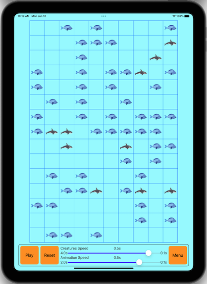
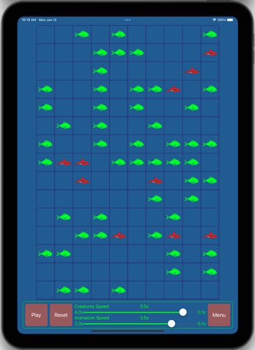

-------------------
SeaLife_Swift
=============

SeaLife_Swift is Swift version of [SeaLife](https://github.com/Pozhidaev/SeaLife) project

SeaLife_Swift is a project for experiments with iOS platform, drawing and multithreading.
It simulates life with two types of creatures with simple turn rules. 

Every creature can do one thing per turn:
- Fish can move or reproduce itself one time in X turns (X - fishReproductionPeriod)
- Orca can move or reproduce itself one time in X turns (X - kOrcaReproductionPeriod), or eat fish. If Orca doesn't eat more then Y turns it dies (Y - kOrcaAllowedHungerPoins) 

Concrete values are in Constants.swift file

 

 Light mode | Dark mode
--- | ---
 | 

 

## Project capabilities:
* you can customize creatures count on start
* you can customize world size on start, but with constant aspect ratio
* you can customize creatures timers speed while world is running
* you can customize creatures animations speed while world is running
* Supports iPhone & iPad
* Supports Dark & Light user interface
* Supports portrait & landscape orientations

#### ToDo:
* Any world sizes aspect ratio
* Make all UI to be constructed from code
* On iPad make control panel to be placed on the right when in landscape
* Make animations to be different for different creatures
